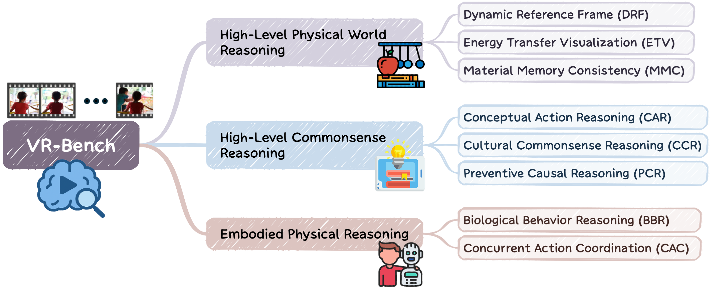

<h1>Lumos-Nexus: Efficient Frequency Bridging with Homogeneous Latent Space for Video Unified Models</h1>

<blockquote>
  <p>We propose <strong>Lumos-Nexus</strong>, a training-efficient unified video generation framework that aligns a lightweight generator with the understanding block for reasoning-driven semantic control during training, and applies Unified Progressive Frequency Bridging at inference to progressively hand off to a high-capacity pretrained generator in a shared latent space for coarse-to-fine, high-fidelity video.</p>
</blockquote>

</td>
</tr>
</table>

[](https://openreview.net/forum?id=r5o6PWgzav)
[](https://arxiv.org/abs/2603.20192)
[](https://github.com/alibaba-damo-academy/Lumos-Custom)
[](https://jiazheng-xing.github.io/nexus-lumos-home/)


### 🧑‍💻 Authors

<div align="center" style="font-size: 15px; line-height: 1.6;">

[Jiazheng Xing](https://jiazheng-xing.github.io/)<sup>\*1,4,2</sup>, [Hangjie Yuan](https://jacobyuan7.github.io/)<sup>\*‡2,3,1</sup>, Lingling Cai<sup>1</sup>, Xinyu Liu<sup>5</sup>, Yujie Wei<sup>6</sup>, Fei Du<sup>2,3</sup>, Hai Ci<sup>4</sup>, Tao Feng<sup>7</sup>, 
Jiasheng Tang<sup>2,3</sup>, Weihua Chen<sup>†2,3</sup>, Fan Wang<sup>2</sup>, Yong Liu<sup>†1</sup>

<sup>1</sup>Zhejiang University, <sup>2</sup>DAMO Academy, Alibaba Group, <sup>3</sup>Hupan Lab, <sup>4</sup>National University of Singapore, <sup>5</sup>Hong Kong University of Science and Technology, <sup>6</sup>Fudan University, <sup>7</sup>Tsinghua University

<sup>\*</sup>Equal contributions  <sup>‡</sup>Project lead  <sup>†</sup>Corresponding authors

Contact: jiazhengxing@zju.edu.cn, kugang.cwh@alibaba-inc.com, yongliu@iipc.zju.edu.cn

Project Page: https://jiazheng-xing.github.io/nexus-lumos-home/ 
</div>

<details>
  <summary><strong>📘 Click to view Abstract</strong></summary>

> Connector-based video unified models have demonstrated strong capability in instruction-grounded video synthesis, but integrating a large high-fidelity generator into the unified training loop is computationally prohibitive, limiting achievable visual quality.
> We therefore propose Lumos-Nexus, a training-efficient unified video generation framework that facilitates the development of strong reasoning-driven generation capabilities while significantly enhancing visual fidelity. Lumos-Nexus adopts a two-stage design: 1) During training, only a lightweight generator is aligned with the understanding block to learn to take in reasoning-driven semantic control. 2) During inference, we introduce Unified Progressive Frequency Bridging (UPFB) to progressively hand off generation to a high-capacity pretrained generator in the shared latent space, enabling coarse-to-fine refinement and producing high-fidelity videos without compromising reasoning quality. To fill the gap in reasoning-driven video generation benchmarks, we introduce VR-Bench, which assesses a model's capability to translate inferred intent into coherent and semantically aligned video content.
> Extensive experiments demonstrate that Lumos-Nexus achieves substantial gains in visual realism and temporal coherence on VBench, while exhibiting strong reasoning-based generative performance on VR-Bench.

</details>


## Demo

<div align="center">
<table>
<tr>
<td align="center" colspan="4"><b>High-Level Physical World Reasoning</b></td>
</tr>
<tr>
<td align="center" colspan="4">
  
</td>
</tr>
<tr>
<td align="center" width="25%"><b>Wan2.1 1.3B</b><br/>
  
</td>
<td align="center" width="25%"><b>Wan2.1 14B</b><br/>
  
</td>
<td align="center" width="25%"><b>Omni Video</b><br/>
  
</td>
<td align="center" width="25%"><b>Lumos Nexus</b><br/>
  
</td>
</tr>
</table>
</div>

<div align="center">
<table>
<tr>
<td align="center" colspan="4"><b>High-Level Commonsense Reasoning</b></td>
</tr>
<tr>
<td align="center" colspan="4">
  
</td>
</tr>
<tr>
<td align="center" width="25%"><b>Wan2.1 1.3B</b><br/>
  
</td>
<td align="center" width="25%"><b>Wan2.1 14B</b><br/>
  
</td>
<td align="center" width="25%"><b>Omni Video</b><br/>
  
</td>
<td align="center" width="25%"><b>Lumos Nexus</b><br/>
  
</td>
</tr>
</table>
</div>

<div align="center">
<table>
<tr>
<td align="center" colspan="4"><b>Embodied Physical Reasoning</b></td>
</tr>
<tr>
<td align="center" colspan="4">
  
</td>
</tr>
<tr>
<td align="center" width="25%"><b>Wan2.1 1.3B</b><br/>
  
</td>
<td align="center" width="25%"><b>Wan2.1 14B</b><br/>
  
</td>
<td align="center" width="25%"><b>Omni Video</b><br/>
  
</td>
<td align="center" width="25%"><b>Lumos Nexus</b><br/>
  
</td>
</tr>
</table>
</div>


## 🚀 Method Overview


### Framework Architecture

Overview of Lumos-Nexus. (a): The connector and small generator are fine-tuned within the connector-based video unified model during training. (b): inference performs Unified Progressive Frequency Bridging (UPFB) to combine the small generator's semantic guidance with high-fidelity details from the large generator for high-quality video generation.


<div align="center">
  
</div>

---

### Benchmark · VR-Bench taxonomy

VR-Bench covers three hierarchical categories: (1) High-Level Physical World Reasoning, capturing physical dynamics and material interactions; (2) High-Level Commonsense Reasoning, assessing causal, cultural, and abstract behavioral understanding; and (3) Embodied Physical Reasoning, focusing on motion coherence and grounded physical interactions.


<div align="center">
  
</div>


## 🔧 Installation


### Environment

```bash
git clone https://github.com/alibaba-damo-academy/Lumos-Custom.git   # or your fork; place / sync this codebase as needed
cd lumos-nexus

conda create -n lumos-nexus python=3.10
conda activate lumos-nexus
pip install -r requirements.txt
```


## 🔑 Pretrained Model Preparations

This codebase uses **OmniVideo 1** checkpoints and **Wan2.1-T2V-14B** as the high-capacity generator for UPFB inference. Download both from Hugging Face and place them under the repository root as **`model_ckpts/`**.

| Component | Hugging Face repo | Local path |
|-----------|-------------------|------------|
| **OmniVideo11B** (connector, adapter, small generator, etc.) | [howellyoung1/OmniVideo11B](https://huggingface.co/howellyoung1/OmniVideo11B) | `model_ckpts/` |
| **Wan2.1-T2V-14B** (high-fidelity generator) | [Wan-AI/Wan2.1-T2V-14B](https://huggingface.co/Wan-AI/Wan2.1-T2V-14B) | `model_ckpts/Wan2.1-T2V-14B/` |

```bash
pip install huggingface_hub

# OmniVideo11B bundle
huggingface-cli download howellyoung1/OmniVideo11B --local-dir model_ckpts

# Wan2.1-T2V-14B (used by UPFB at inference)
huggingface-cli download Wan-AI/Wan2.1-T2V-14B --local-dir model_ckpts/Wan2.1-T2V-14B
```

After download, `model_ckpts/` should contain the OmniVideo subfolders (e.g. `adapter/`, `wan/`, `ar_model/`, …) and a **`Wan2.1-T2V-14B/`** directory (see [`video_generator.py`](video_generator.py) for expected layout). Set `OMNI_MODELS_DIR` / `MODELS_DIR` in the shell scripts if you use a different root.

---


## 🎈 Quick Start

| Item | Location |
|------|-----------|
| Regular batch T2V (prompt list) | [`inf_batch_gen.sh`](inf_batch_gen.sh) → [`generate_batch.py`](generate_batch.py) |
| VR-Bench batch T2V (reasoning JSON) | [`inf_batch_gen_vrbench.sh`](inf_batch_gen_vrbench.sh) → [`generate_reasoning_prompts.py`](generate_reasoning_prompts.py) |


**1) Regular batch T2V**

For routine batch text-to-video, use a plain prompt list (**one prompt per line**). The format matches [`prompts/vbench_prompt.txt`](prompts/vbench_prompt.txt); copy it or write your own, then set the list path in [`inf_batch_gen.sh`](inf_batch_gen.sh) (see `LIST_FILE` / header comments for `PROMPT_LIST_FILE`).

```bash
bash inf_batch_gen.sh
```

Adjust GPUs, ports, `MODELS_DIR`, `OUTPUT_DIR`, and the prompt list path in `inf_batch_gen.sh` as needed.

**2) VR-Bench batch videos**

To produce the VR-Bench reasoning set for **evaluation**, use the reasoning-JSON pipeline. You can run the eval in [`vr_bench_eval/`](vr_bench_eval/) on these outputs (see **Benchmark Evaluation (VR-Bench)** below).

```bash
export REASONING_JSON=/path/to/reasoning_prompts.json
bash inf_batch_gen_vrbench.sh
```

Edit GPUs, ports, `MODELS_DIR`, `OUTPUT_DIR`, and `REASONING_JSON` at the top of `inf_batch_gen_vrbench.sh` as needed.


## 🧪 Benchmark Evaluation (VR-Bench)

After you have generated the corresponding videos, run the bundled eval driver from the **`vr_bench_eval`** directory (it sets `PYTHONPATH` and launches the scripts under [`evaluations/`](vr_bench_eval/evaluations/) using prompts in [`prompts_checked/`](vr_bench_eval/prompts_checked/)).

> **Important:** before running evaluation, make sure you explicitly set/modify the input video root and model names via `run_qwen.sh` environment variables (or export them in shell):
>
> - `VR_BENCH_VIDEO_ROOT`: root directory containing generated videos
> - `VR_BENCH_MODELS`: model subfolder name(s), comma-separated for multiple models
> - `VR_BENCH_VLM_PATH`: local Qwen3-VL (or compatible) checkpoint path used by evaluators

Example:

```bash
cd vr_bench_eval
export VR_BENCH_VIDEO_ROOT="/path/to/your/outputs"
export VR_BENCH_MODELS="Lumos_Nexus"
export VR_BENCH_VLM_PATH="/path/to/Qwen3-VL-30B-A3B-Instruct"
bash run_qwen.sh
```

Also check comments in [`run_qwen.sh`](vr_bench_eval/run_qwen.sh) for optional `VR_BENCH_HF_HOME` and GPU selection via `RUN_GPU_IDS`.


## 📎 Citation

If you find this work helpful, please consider citing:

```bibtex
@article{xing2026lumosnexus,
  title   = {{Lumos-Nexus: Efficient Frequency Bridging with Homogeneous Latent Space for Video Unified Models}},
  author  = {Xing, Jiazheng and Yuan, Hangjie and Cai, Lingling and Liu, Xinyu and Wei, Yujie and Du, Fei and Ci, Hai and Feng, Tao and Tang, Jiasheng and Chen, Weihua and Wang, Fan and Liu, Yong},
  journal = {arXiv preprint arXiv:2603.20192},
  year    = {2026}
}
```


## 📣 Disclaimer

This repository accompanies **Lumos-Nexus**. Demo assets on the project page may include benchmark or community examples; contact the authors if any should be removed.


## 💞 Acknowledgements

* [Wan2.1](https://github.com/Wan-Video/Wan2.1)
* [Qwen3-VL](https://github.com/QwenLM/Qwen3-VL)

The `nexus-lumos-home/` site is based on an academic project-page template (see [`nexus-lumos-home/README.md`](nexus-lumos-home/README.md)).
