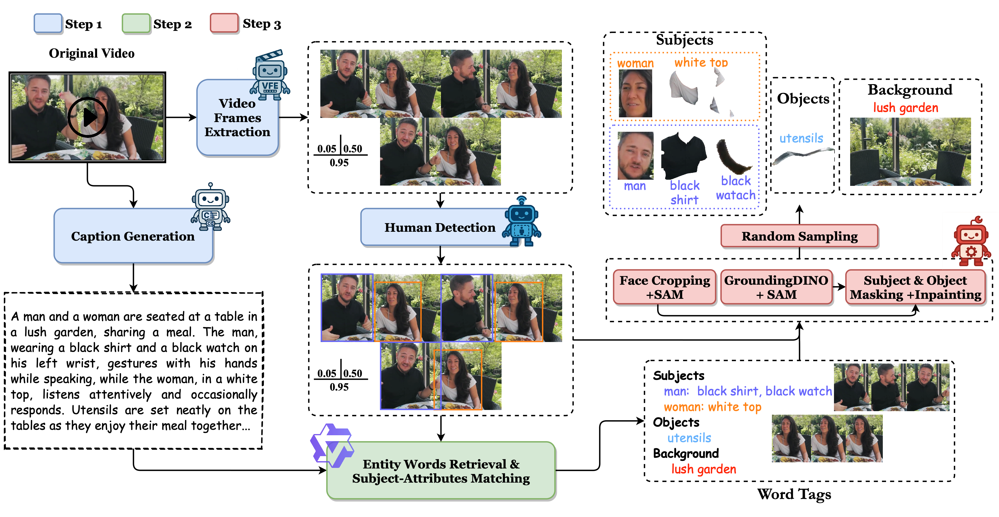
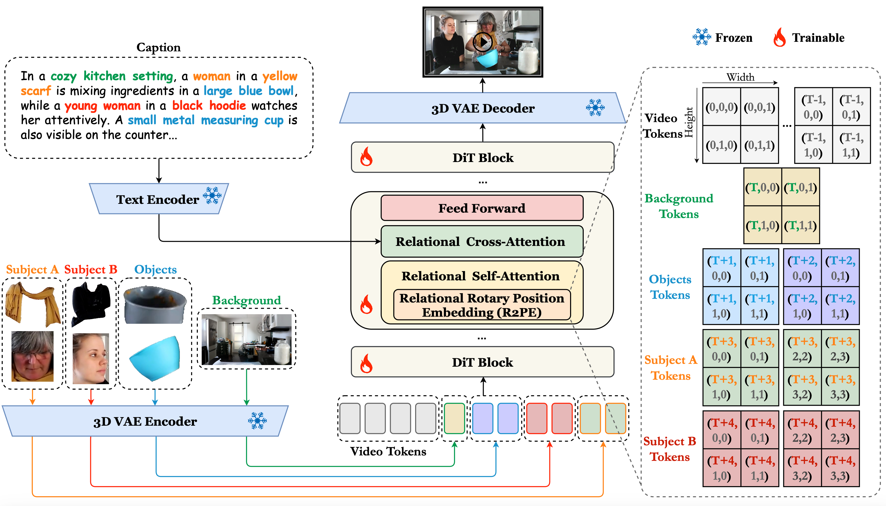

# LumosX: Relate Any Identities with Their Attributes for Personalized Video Generation

> Recent advances in diffusion models have significantly improved text-to-video generation, enabling personalized content creation with fine-grained control over both foreground and background elements. However, precise face-attribute alignment across subjects remains challenging, as existing methods lack explicit mechanisms to ensure intra-group consistency. We propose **LumosX**, a framework that advances both data and model design to achieve state-of-the-art performance in fine-grained, identity-consistent, and semantically aligned personalized multi-subject video generation.

[](https://arxiv.org/abs/2603.20192)
[](https://github.com/alibaba-damo-academy/Lumos-Custom)
[](https://jiazheng-xing.github.io/lumosx-home/)
[](https://huggingface.co/Alibaba-DAMO-Academy/LumosX)

---

### 🧑‍💻 Authors
<div align="center" style="font-size: 15px; line-height: 1.6;">

[Jiazheng Xing](https://jiazheng-xing.github.io/)<sup>1,4,2,\*</sup>, Fei Du<sup>2,3,\*</sup>, [Hangjie Yuan](https://jacobyuan7.github.io/)<sup>2,3,1,\*</sup>, Pengwei Liu<sup>1,2</sup>, Hongbin Xu<sup>4</sup>, Hai Ci<sup>4</sup>, Ruigang Niu<sup>2,3</sup>, Weihua Chen<sup>2,3</sup><sup>†</sup>, Fan Wang<sup>2</sup>, Yong Liu<sup>1</sup><sup>†</sup>

<sup>1</sup>Zhejiang University, <sup>2</sup>DAMO Academy, Alibaba Group, <sup>3</sup>Hupan Lab, <sup>4</sup>National University of Singapore

<sup>\*</sup>Equal contributions  <sup>†</sup>Corresponding authors

Contact: jiazhengxing@zju.edu.cn, kugang.cwh@alibaba-inc.com, yongliu@iipc.zju.edu.cn

Project Page: https://jiazheng-xing.github.io/lumosx-home/

</div>

<details>
  <summary><strong>📘 Click to view Abstract</strong></summary>

> Recent advances in diffusion models have significantly improved text-to-video generation, enabling personalized content creation with fine-grained control over both foreground and background elements. However, precise face-attribute alignment across subjects remains challenging, as existing methods lack explicit mechanisms to ensure intra-group consistency. Addressing this gap requires both explicit modeling strategies and face-attribute-aware data resources. We therefore propose **LumosX**, a framework that advances both data and model design.

> On the data side, a tailored collection pipeline orchestrates captions and visual cues from independent videos, while multimodal large language models (MLLMs) infer and assign subject-specific dependencies. These extracted relational priors impose a finer-grained structure that amplifies the expressive control of personalized video generation and enables the construction of a comprehensive benchmark.

> On the modeling side, Relational Self-Attention and Relational Cross-Attention intertwine position-aware embeddings with refined attention dynamics to inscribe explicit subject-attribute dependencies, enforcing disciplined intra-group cohesion and amplifying the separation between distinct subject clusters. Comprehensive evaluations on our benchmark demonstrate that LumosX achieves state-of-the-art performance in fine-grained, identity-consistent, and semantically aligned personalized multi-subject video generation.

</details>

---

## Demo

### Identity-Consistent Video Generation

<div align="center">
<table>
<tr>
<td align="center" width="50%">
  
</td>
</tr>
</table>
<table>
<tr>
<td align="center" width="33%"><b>SkyReels</b><br/>
  
</td>
<td align="center" width="33%"><b>Phantom</b><br/>
  
</td>
<td align="center" width="33%"><b>LumosX</b><br/>
  
</td>
</tr>
</table>
</div>

<div align="center">
<table>
<tr>
<td align="center" width="50%">
  
</td>
</tr>
</table>
<table>
<tr>
<td align="center" width="33%"><b>SkyReels</b><br/>
  
</td>
<td align="center" width="33%"><b>Phantom</b><br/>
  
</td>
<td align="center" width="33%"><b>LumosX</b><br/>
  
</td>
</tr>
</table>
</div>

### Subject-Consistent Video Generation

<div align="center">

<table>
<tr>
<td align="center" width="50%">
  
</td>
</tr>
</table>

<table>
<tr>
<td align="center" width="33%">
  <b>Skyreels</b><br/>
  
</td>
<td align="center" width="33%">
  <b>Phantom</b><br/>
  
</td>
<td align="center" width="33%">
  <b>LumosX</b><br/>
  
</td>
</tr>
</table>

</div>

<div align="center">

<table>
<tr>
<td align="center" width="50%">
  
</td>
</tr>
</table>

<table>
<tr>
<td align="center" width="33%">
  <b>Skyreels</b><br/>
  
</td>
<td align="center" width="33%">
  <b>Phantom</b><br/>
  
</td>
<td align="center" width="33%">
  <b>LumosX</b><br/>
  
</td>
</tr>
</table>

</div>

---

## 🚀 Method Overview

### Framework Architecture

LumosX addresses the challenge of precise face-attribute alignment in personalized video generation through a dual-pronged approach:

<div align="center">
    
</div>

**Data Side - Relational Data Construction Pipeline:**
- We build the training dataset from raw videos in three steps: (1) generate a caption and detect human subjects in extracted frames; (2) retrieve entity words from the caption and match subjects with their attributes; (3) use these entity tags to localize and segment target subjects and objects, producing a clean background image.

<div align="center">
    
</div>

**Modeling Side - Relational Explicit Modeling:**
- Built on the Wan2.1-T2V model, our framework encodes all condition images into image tokens via a VAE encoder, concatenates them with denoising video tokens, and feeds the result into DiT blocks. Within each block, the proposed Relational Self-Attention and Relational Cross-Attention enable causal conditional modeling, enhance visual token representations, and ensure precise face–attribute alignment.

### Benchmark Evaluation

LumosX provides comprehensive evaluation benchmarks in the `benchmark/` directory:

- **`face_consistency_eval/`**: Evaluates identity preservation with ArcSim and CurSim using only face reference images as input in this experiment.

- **`subject_consistency_eval/`**:Evaluates comprehensive multi-subject video customization, using reference inputs that include faces, attributes, objects, and background images.


Each subdirectory contains distributed evaluation scripts and one-click `*.sh` launch files for automatic evaluation of large-scale generation results on multiple GPUs.

---

## 🔧 Installation

### Setup Repository and Conda Environment

```bash
git clone https://github.com/alibaba-damo-academy/Lumos-Custom.git
cd Lumos-Custom/LumosX

conda create -n lumosx python=3.10
conda activate lumosx
```

### Install Common Dependencies

```bash
pip install -r requirements.txt
```

### Install FlashAttention

> Make sure that ninja is installed and that it works correctly (e.g. `ninja --version` then `echo $?` should return exit code 0). If not, uninstall then reinstall ninja (`pip uninstall -y ninja && pip install ninja`). Without ninja, compiling can take a very long time (2h) since it does not use multiple CPU cores. With ninja compiling takes 3-5 minutes on a 64-core machine using CUDA toolkit.

```bash
# Make sure to install ninja with proper version, like 1.11.1.3
pip uninstall -y ninja && pip install ninja==1.11.1.3

# Install flash-attention 2
pip install flash-attn --no-build-isolation
# https://github.com/Dao-AILab/flash-attention/releases (especially for v2.8.1)
```

### Install `training_acc` to Activate Sequence Parallel

```bash
# Please check the package version
pip install packages/training_acc-0.0.3-py3-none-any.whl packages/astra-0.0.1-py3-none-any.whl
```

### Install MagiAttention 

```bash
# Install MagiAttention from source
# Repository: https://github.com/SandAI-org/MAGI-1
git clone https://github.com/SandAI-org/MagiAttention.git
cd MagiAttention
git submodule update --init --recursive
pip install --no-build-isolation .
```

---

## 🔑 Pretrained Model Preparations

### Download LumosX Models

LumosX is built upon the WanX2.1 text-to-video model series. **All** inference weights are published in a single Hugging Face repo — **[Alibaba-DAMO-Academy/LumosX](https://huggingface.co/Alibaba-DAMO-Academy/LumosX)** — matching the layout on the **Files and versions** tab:

| Component | Location in the repo |
|-----------|----------------------|
| **LumosX checkpoint(s)** | `LumosX_models/` |
| **T5 text encoder (UMT5-XXL)** | `models_t5_umt5-xxl-enc-bf16.pth` |
| **T5 tokenizer** | `umt5-xxl/` |
| **Video VAE** | `vae.pth` |

**Download via Hugging Face** (one command pulls the full bundle, including the folders above):

```bash
pip install huggingface_hub

huggingface-cli download Alibaba-DAMO-Academy/LumosX --local-dir ./cache/LumosX_hub
```

```python
from huggingface_hub import snapshot_download
snapshot_download("Alibaba-DAMO-Academy/LumosX", local_dir="./cache/LumosX_hub")
```

**Local layout** after download (same as on Hugging Face):

```
cache/LumosX_hub/
├── LumosX_models/                    # trained LumosX weights (.pt)
├── umt5-xxl/                         # UMT5-XXL tokenizer
├── models_t5_umt5-xxl-enc-bf16.pth   # UMT5-XXL encoder
├── vae.pth                           # video VAE
├── config.json
└── README.md
```

**Note:** The trained LumosX checkpoint path is specified via `--ckpt-path` in the inference command. See the Quick Start section for usage examples.

### Download Evaluation Models

For detailed instructions on downloading evaluation models (VideoCLIP-XL, Florence2, YOLOv9, ArcFace, CurricularFace, OWLv2, CLIP, DINOv2, RAFT), please refer to [benchmark/README.md](benchmark/README.md).

---

## 🎈 Quick Start

**Two demos** are ready to run via shell scripts in [`LumosX/`](LumosX/):

| Demo | Script | Description |
|------|--------|-------------|
| 1 | [`test_face.sh`](test_face.sh) | Face-identity consistent personalized video generation |
| 2 | [`test_subject.sh`](test_subject.sh) | Multi-subject generation with subject–attribute relations |

**Prerequisites:** weights under `./cache/LumosX_hub/` (see **Pretrained Model Preparations**) and sample layouts under `./test_data/identity_consistency_test_data` and `./test_data/subject_consistency_test_data` (see **Benchmark Evaluation**).

```bash
cd LumosX
bash test_face.sh
bash test_subject.sh
```

Adjust GPU count, ports, paths, or `--save-dir` inside the scripts if needed.

---

### Personalized Video Generation with Face-Identity Constraints

**Run the demo:** `bash test_face.sh` (from `LumosX/`).

Equivalent full command (same as [`test_face.sh`](test_face.sh)):

```bash
cd LumosX

torchrun --nproc_per_node=2 --master_port=23422 \
    scripts/WanX2.1/lumosx_inference_t2v_face.py \
    configs/wanx/inference/lumosx_t2v_config.py \
    --image-size 480 832 \
    --prompt-as-path \
    --prompt-path ./test_data/identity_consistency_test_data \
    --ckpt-path "./cache/LumosX_hub/LumosX_models" \
    --t5-checkpoint-path './cache/LumosX_hub/models_t5_umt5-xxl-enc-bf16.pth' \
    --t5-tokenizer-path './cache/LumosX_hub/umt5-xxl' \
    --vae-path "./cache/LumosX_hub/vae.pth" \
    --save-dir "samples/lumosx_test/identity_consistency"
```

**Input Format:**
- Each sample corresponds to a directory containing:
  - `caption.txt`: Natural language description
  - Face crops and mask information organized in subdirectories

### Multi-Subject Video Generation with Subject-Attribute Relations

**Run the demo:** `bash test_subject.sh` (from `LumosX/`).

Equivalent full command (same as [`test_subject.sh`](test_subject.sh)):

```bash
cd LumosX

torchrun --nproc_per_node=2 --master_port=23422 \
    scripts/WanX2.1/lumosx_inference_t2v_subject.py \
    configs/wanx/inference/lumosx_t2v_config.py \
    --image-size 480 832 \
    --prompt-as-path \
    --prompt-path ./test_data/subject_consistency_test_data \
    --ckpt-path "./cache/LumosX_hub/LumosX_models" \
    --t5-checkpoint-path './cache/LumosX_hub/models_t5_umt5-xxl-enc-bf16.pth' \
    --t5-tokenizer-path './cache/LumosX_hub/umt5-xxl' \
    --vae-path "./cache/LumosX_hub/vae.pth" \
    --save-dir "samples/lumosx_test/subject_consistency"
```

**Input Format (both scripts share the same structure):**
- Each sample corresponds to a directory containing:
  - `caption.txt`: Natural language description (can include multiple subjects and attribute relationships)
  - `subjects/`: Face/upper body/attribute crops for each subject
  - (Optional) `objects/`, `background/` for additional element crops


**Key arguments (shared by both `test_face.sh` and `test_subject.sh`):**
- `--nproc_per_node`: Number of GPUs used for distributed inference on this node.
- `--master_port`: TCP port for the torch distributed backend.
- `--image-size`: Target video frame height and width.
- `--prompt-as-path`: Interpret `--prompt-path` as a directory containing test samples instead of raw text.
- `--prompt-path`: Root directory of test data (face-identity or multi-subject, depending on the script).
- `--ckpt-path`: Pretrained LumosX checkpoint — a `.pt` file or a directory such as `./cache/LumosX_hub/LumosX_models` (as in the demo scripts).
- `--t5-checkpoint-path`: Path to the UMT5-XXL encoder weights.
- `--t5-tokenizer-path`: Path to the UMT5-XXL tokenizer folder.
- `--vae-path`: Path to the video VAE checkpoint.
- `--save-dir`: Output directory where generated videos will be written.


---

## 🧪 Benchmark Evaluation

### Benchmark Test Data

Before running the evaluation, you need to first generate videos using the benchmark test data, and then perform the evaluation.

**1. Download Benchmark Test Data**

The benchmark test data is shared for two evaluation tasks:
- **Identity-Consistent Video Generation**: Face consistency evaluation
- **Subject-Consistent Video Generation**: Subject consistency evaluation

**Download:** [Google Drive](https://drive.google.com/file/d/1iQW3wQaydc_nd_9qKaWcdexhMtEoOX7n/view?usp=sharing)

After downloading, extract the data to the `test_data_eval/` directory in the project root. 

**Note:** The same test data can be used for both evaluation tasks. The data is organized into two subdirectories for convenience, but they share the same underlying dataset.

**2. Generate Videos Using Test Data**

After generating videos, save them to the specified directory, then use the evaluation scripts to evaluate them.

- **Identity-Consistent Video Generation**: Refer to the [Face-Identity Video Generation](#personalized-video-generation-with-face-identity-constraints) section, use the `test_face.sh` script, and set `--prompt-path` to `test_data_eval/test_video_data`
- **Subject-Consistent Video Generation**: Refer to the [Multi-Subject Video Generation](#multi-subject-video-generation-with-subject-attribute-relations) section, use the `test_subject.sh` script, and set `--prompt-path` to `test_data_eval/test_video_data`

**3. Run Evaluation**

After generating videos, follow the evaluation procedures below to perform the evaluation.

### Face-Consistency Evaluation

Evaluate face identity consistency in generated videos:

```bash
cd LumosX/benchmark/face_consistency_eval

# Distributed multi-subject face consistency evaluation
bash eval_face.sh
```


### Subject-Consistency Evaluation

Evaluate subject-attribute alignment in generated videos:

```bash
cd LumosX/benchmark/subject_consistency_eval

# Quantitative analysis of subject/attribute alignment using ArcFace/CurricularFace features
bash eval_subject.sh
```

---

## 📎 Citation

If you find our work helpful for your research, please consider giving a star ⭐ and citation 📝

```bibtex
@inproceedings{xinglumosx,
  title={LumosX: Relate Any Identities with Their Attributes for Personalized Video Generation},
  author={Xing, Jiazheng and Du, Fei and Yuan, Hangjie and Liu, Pengwei and Xu, Hongbin and Ci, Hai and Niu, Ruigang and Chen, Weihua and Wang, Fan and Liu, Yong},
  booktitle={The Fourteenth International Conference on Learning Representations}
}
```

---

## 📣 Disclaimer

This is the official code of LumosX. All the copyrights of the demo images and videos are from community users. Feel free to contact us if you would like to remove them.

---

## 💞 Acknowledgements

The code is built upon the below repositories, we thank all the contributors for open-sourcing:

* [Wan2.1](https://github.com/Wan-Video/Wan2.1)
* [Qwen2.5-VL](https://github.com/QwenLM/Qwen2-VL)
* [Flash Attention](https://github.com/Dao-AILab/flash-attention)
