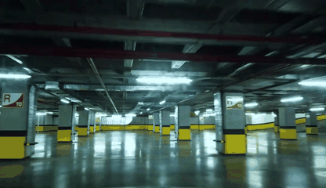
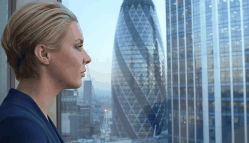
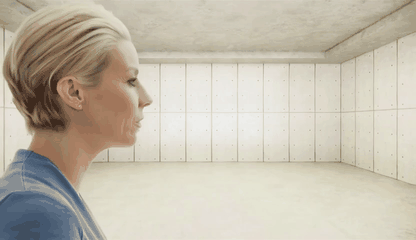
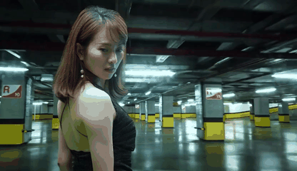

# UniLumos: Fast and Unified Image and Video Relighting with Physics-Plausible Feedback  

> To bridge the gap between generative flexibility and physical correctness, we propose **UniLumos**, a unified relighting framework for both images and videos that brings RGB-space geometry feedback into a flow-matching backbone.

[](https://arxiv.org/abs/2511.01678)
[](https://huggingface.co/Alibaba-DAMO-Academy/UniLumos)
[](https://github.com/alibaba-damo-academy/Lumos-Custom)

---

### 🧑‍💻 Authors
<div align="center" style="font-size: 15px; line-height: 1.6;">

[Ropeway Liu](https://jacobyuan7.github.io/)<sup>1,2,\*</sup>, [Hangjie Yuan](https://jacobyuan7.github.io/)<sup>2,3,1,\*</sup><sup>†</sup>, Bo Dong<sup>2,3</sup>, [Jiazheng Xing](https://jiazheng-xing.github.io/)<sup>1,2,4</sup>, Jinwang Wang<sup>2,3,1</sup>, [Rui Zhao](https://ruizhaocv.github.io/)<sup>4</sup>, Yan Xing<sup>2,3</sup>, Weihua Chen<sup>2,3</sup><sup>†</sup>, Fan Wang<sup>2</sup>

<sup>1</sup>Zhejiang University, <sup>2</sup>DAMO Academy, Alibaba Group, <sup>3</sup>Hupan Lab, <sup>4</sup>National University of Singapore

<sup>\*</sup>Equal contributions  <sup>†</sup>Corresponding Author

</div>

<details>
  <summary><strong>📘 Click to view Abstract</strong></summary>

> Relighting is a crucial task with both practical demand and artistic value, and recent diffusion models have shown strong potential by enabling rich and controllable lighting effects. However, as they are typically optimized in semantic latent space, where proximity does not guarantee physical correctness in visual space, they often produce unrealistic results—such as overexposed highlights, misaligned shadows, and incorrect occlusions.

> We address this with **UniLumos**, a unified relighting framework for both images and videos that brings RGB-space geometry feedback into a flow-matching backbone. By supervising the model with depth and normal maps extracted from its outputs, we explicitly align lighting effects with the scene structure, enhancing physical plausibility. Nevertheless, this feedback requires high-quality outputs for supervision in visual space, making standard multi-step denoising computationally expensive. To mitigate this, we employ path consistency learning, allowing supervision to remain effective even under few-step training regimes.

> To enable fine-grained relighting control and supervision, we design a structured six-dimensional annotation protocol capturing core illumination attributes. Building upon this, we propose LumosBench, a disentangled attribute-level benchmark that evaluates lighting controllability via large vision-language models, enabling automatic and interpretable assessment of relighting precision across individual dimensions.

> Extensive experiments demonstrate that UniLumos achieves state-of-the-art relighting quality with significantly improved physical consistency, while delivering a 20x speedup for both image and video relighting.

</details>

## 📜 News

**[2025/9/19]** Accepted by [NeurIPS 2025](https://openreview.net/forum?id=e9B2NPQanB&referrer=%5BAuthor%20Console%5D(%2Fgroup%3Fid%3DNeurIPS.cc%2F2025%2FConference%2FAuthors%23your-submissions)) !

**[2025/10/29]** Code is available now!

---
## 🚀 Method Overview

### Pipeline
<div align="center">
    
</div>

The overall pipeline of UniLumos. The left is LumosData, our proposed data construction pipeline, which consists of four stages for generating diverse relighting pairs from real-world sources. The right shows the architecture of UniLumos, a unified framework for image and video relighting, designed to achieve physically plausible illumination control.

### LumosBench

To evaluate the fine-grained controllability of lighting generation, we introduce **LumosBench**, a structured benchmark that targets six core illumination attributes defined in our annotation protocol. Our benchmark evaluates the performance of video relighting models from two key perspectives: qualitative alignment with user prompts and quantitative measurement of physical lighting properties. More details can be found in [LumosBench](UniLumos/LumosBench/readme.md).

## 🔧 Installations

### Setup repository and conda environment

```bash
git clone https://github.com/alibaba-damo-academy/Lumos-Custom.git
cd unilumos

conda create -n unilumos python=3.10
conda activate unilumos

pip install -r requirements.txt
pip install flash-attn 
# recommend using flash-attn to accelerate the training and inference of UniLumos
# https://github.com/Dao-AILab/flash-attention/releases (especially for v2.8.1)
```

## 🔑 Pretrained Model Preparations

```bash
# Model downloading is automatic.
# see UniLumos/UniLumos/weights/readme.txt for more details
```

## 🎈 Quick Start

### Perform foreground sequences relighting with background generation

Below is a 4x5 grid of generated videos, combining **4 foreground videos** (rows) and **5 background videos** (columns).

| Foreground ↓ \\ Background → | |||||
|------------------------------|:---:|:---:|:---:|:---:|:---:|
|  |  |  |  |  |  |
|  |  |  |  |  |  |
|  |  |  |  |  |  |
|  |  |  |  |  |  |

> Relighting with captions, foreground videos, and background videos
```bash
# relighting with captions, foreground videos, and background videos
python unilumos_infer_abc.py
```
> Relighting with captions and foreground videos
```bash
# relighting with captions and foreground videos
python unilumos_infer_ab.py
```

> Relighting with captions and background videos
```bash
# relighting with captions and foreground videos
python unilumos_infer_ac.py
```

> Relighting only with captions
```bash
# relighting with captions and foreground videos
python unilumos_infer_a.py
```

- see in UniLumos/UniLumos/run_infer.sh for more details.
- you can change the number of sample_steps and sample_shift to control the quality and speed of the generated video.

### Perform image relighting

```bash
# here --image_size is (768, 512), --num_frames is 1
python unilumos_infer_image.py
```

### Perform LumosBench evaluation

See in LumosBench/readme.md for more details.
```bash
# there are many steps to run the evaluation, you can see in LumosBench/readme.md.
python main.py
```

### Baseline Video Relighting

<div align="center">
    
</div>

Qualitative comparison of baseline methods. Each method takes a subject video and a textual illumination description as input, generating the related subject with the corresponding background under the specified lighting condition.

## 📎 Citation 

If you find our work helpful for your research, please consider giving a star ⭐ and citation 📝 
```bibtex

```

## 📣 Disclaimer

This is official code of UniLumos.
All the copyrights of the demo images and audio are from community users. 
Feel free to contact us if you would like remove them.

## 💞 Acknowledgements
The code is built upon the below repositories, we thank all the contributors for open-sourcing. It is greatly appreciated that the community has contributed various extensions to UniLumos.

* [Wan2.1](https://github.com/Wan-Video/Wan2.1)
* [Qwen2.5-VL](https://github.com/lllyasviel/IC-Light)
* [LTX-Video](https://github.com/Lightricks/LTX-Video)
* [CogVideoX](https://github.com/THUDM/CogVideo)
* [HunyuanVideo](https://github.com/Tencent-Hunyuan/HunyuanVideo)
* [IC-Light](https://github.com/lllyasviel/IC-Light)
* [Light-A-Video](https://github.com/bcmi/Light-A-Video)
