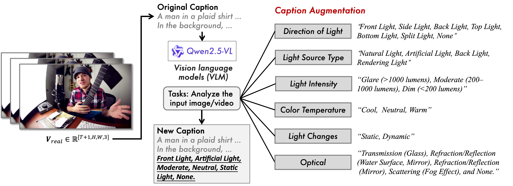

# LumosBench: An Attribute-level Controllability Benchmark

<b> To evaluate the fine-grained controllability of lighting generation, we introduce **LumosBench**, a structured benchmark that targets six core illumination attributes defined in our annotation protocol. </b>

</div>



Our benchmark evaluates the performance of video relighting models from two key perspectives: qualitative alignment with user prompts and quantitative measurement of physical lighting properties.

## Qualitative Controllability Score
To assess how well a model can control specific lighting attributes, we employ a model-based evaluation approach:

- Each prompt pairs a video scene with a structured caption designed to isolate and modify a single lighting attribute, while keeping all other variables constant. These prompts cover six distinct categories: direction, light source type, intensity, color temperature, temporal dynamics, and optical phenomena.
- To measure the alignment between the intended and the generated lighting, we use the powerful vision-language model Qwen2.5-VL to analyze the relit video outputs. The VLM's task is to classify whether the target attribute was correctly expressed in the generated video.
- Each of the six dimensions is scored independently, and the final controllability score is the average across all dimensions, providing a comprehensive measure of the model's fine-grained control.

## Quantitative Physical Metrics
In addition to the qualitative assessment of attribute control, LumosBench also provides quantitative analysis of the lighting's physical properties. This is achieved by calculating objective metrics from a representative frame of the generated video, including:
- Correlated Color Temperature (CCT): Measures the warmth or coolness of the light in Kelvin.
- Illuminance: Measures the intensity or brightness of the light falling on the scene.
- xy Color Coordinates: Provides a precise location on the CIE color space chromaticity diagram.

These metrics enable objective, repeatable measurements of the generated light, offering a complementary perspective to the model-based qualitative evaluation.

**Example Output** 

The combined output for a single video provides a comprehensive analysis, integrating both qualitative and quantitative results. A typical result is structured as follows:

```python
// Analysis Result for a single video:
{
    "cct": 5500.0,
    "illuminance": 800.5,
    "xy": [0.332, 0.341],
    "qualitative": {
        "Direction of Light": "Front Light",
        "Light Source Type": "Natural Light",
        "Light Intensity": "Moderate",
        "Color Temperature": "Cool Tone",
        "Light Changes in Time": "Static Light",
        "Optical Phenomena": "None"
    }
}
```

## ⚙️ LumosBench Installation

```shell
pip install -r requirements.txt 
```

## 🤗 Checkpoints

Here, please run the following command to download the weights of Qwen2.5-VL:
```shell
# pip intsall huggingface-cli
# export HF_ENDPOINT=https://hf-mirror.com
huggingface-cli download qwen/Qwen2.5-VL-7B-Instruct --local-dir ./weights/Qwen2.5-VL-7B-Instruc
```

## Quick Start

```shell
# --------step 0: Generating videos prompts.--------
# This step creates a structured JSONL file containing detailed prompts. Each prompt combines a scene description with a specific lighting condition.
# Navigate to the scripts directory and run the prompt generator
# This script will create the final dataset file (e.g., final_dataset_2k.jsonl) inside the 'jsonls' directory.
python jsonls/gen_prompts.py

# --------step 1: Generating videos according to the prompt.--------
# Please save the generated videos to the path './results_gen_videos'
# Run your video generation script
# It should read the prompts and save the output videos to the specified directory.
python path/to/your/video_generator.py \
    --prompts_file jsonls/final_dataset_2k.jsonl \
    --output_dir ./results_gen_videos

# --------step 2: Using LumosBench to test, and obtain a score.--------
# Finally, run the LumosBench evaluation script to test the generated videos and obtain a performance score.
# The export command sets the multiprocessing start method to spawn, which is required by vllm to avoid CUDA initialization errors in subprocesses.
export VLLM_WORKER_MULTIPROC_METHOD=spawn

# Run the main evaluation script
# This script will likely process videos from './results_gen_videos'
python main.py
```

## 💞 Acknowledgements

The code is built upon the below repositories, we thank all the contributors for open-sourcing.

* [Qwen2.5-VL](https://github.com/lllyasviel/IC-Light)
* [LTX-Video](https://github.com/Lightricks/LTX-Video)
* [CogVideoX](https://github.com/THUDM/CogVideo)
* [HunyuanVideo](https://github.com/Tencent-Hunyuan/HunyuanVideo)
* [Wan2.1](https://github.com/Wan-Video/Wan2.1)
* [IC-Light](https://github.com/lllyasviel/IC-Light)
* [Light-A-Video](https://github.com/bcmi/Light-A-Video)